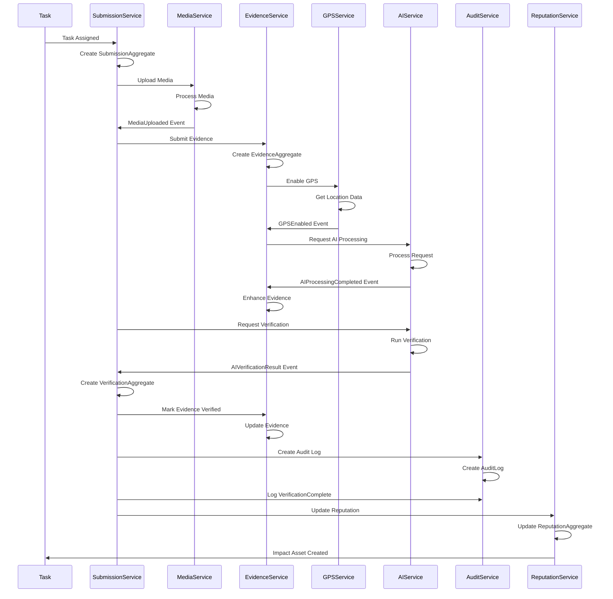

# Service Sequence Diagram

```mermaid
sequenceDiagram
    participant T as Task
    participant S as SubmissionService
    participant M as MediaService
    participant E as EvidenceService
    participant G as GPSService
    participant A as AIService
    participant AU as AuditService
    participant R as ReputationService

    T->>S: Task Assigned
    S->>S: Create SubmissionAggregate
    S->>M: Upload Media
    M->>M: Process Media
    M->>S: MediaUploaded Event
    S->>E: Submit Evidence
    E->>E: Create EvidenceAggregate
    E->>G: Enable GPS
    G->>G: Get Location Data
    G->>E: GPSEnabled Event
    E->>A: Request AI Processing
    A->>A: Process Request
    A->>E: AIProcessingCompleted Event
    E->>E: Enhance Evidence
    S->>A: Request Verification
    A->>A: Run Verification
    A->>S: AIVerificationResult Event
    S->>S: Create VerificationAggregate
    S->>E: Mark Evidence Verified
    E->>E: Update Evidence
    S->>AU: Create Audit Log
    AU->>AU: Create AuditLog
    S->>AU: Log VerificationComplete
    S->>R: Update Reputation
    R->>R: Update ReputationAggregate
    R->>T: Impact Asset Created
```